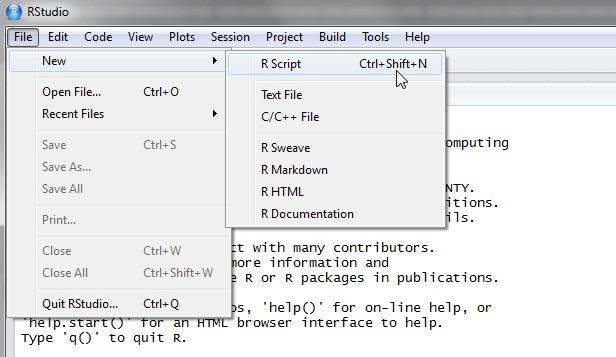

# Introduction

RStudio allows the user to run R in a user-friendly environment.
It is *open-source* (i.e. free) and used by millions of users, meaning that it is *always kept up to date* and improved with new functions, and that there is *plenty of online support available* for most of the issues you might encounter (see https://stackoverflow.com).

There are also *numerous R related tutorials and/or resources* that you will be able to find online.

---

# RStudio interface

The usual Rstudio screen has four windows:

1.(top left)  Editor (your script/notes) and data view.

2.(bottom left)  Console.

3.(top right)  Workspace and history.

4.(bottom right)  Files, plots, packages and help.

---

# R script

The R script is where you keep a record of your work. For Stata users
this would be like the do-file, for SPSS users is like the syntax and
for SAS users the SAS program.

---

# R script

To create a new R script you can either go to File -\> New -\> R Script,
or click on the icon with the "+" sign and select "R Script", or simply
press Ctrl+Shift+N. Make sure to save the script.

---

---

# Workspace tab

The workspace tab stores any object, value, function or anything you
create during your R session. In the example below, if you click on the
dotted squares you can see the data on a screen to the left.

---

# History tab 

The history tab keeps a record of all previous commands. It helps when
testing and running processes. Here you can either **save** the whole
list or you can **select** the commands you want and send them to an R
script to keep track of your work.

In this example, we select all and click on the "To Source" icon, a
window on the left will open with the list of commands. Make sure to
save the 'untitled1' file as an \*.R script.

---

# Changing the working directory 

---

# Setting a default working directory

---

# Packages tab 

The package tab shows the list of add-ons included in the installation
of RStudio. If checked, the package is loaded into R, if not, any
command related to that package won't work, you will need select it. You
can also install other add-ons by clicking on the 'Install Packages'
icon. Another way to activate a package is by typing, for example,
library(foreign). This will automatically check the \--foreign package
(it helps bring data from proprietary formats like Stata, SAS or SPSS).

---

# Installing a package 

---

# Plots tab (1) 

---

# Plots tab (2) 

---

# Plots tab (3) -- Graphs export 

To extract the graph, click on "Export"
where you can save the file as an image (PNG, JPG, etc.) or as PDF,
these options are useful when you only want to share the graph or use it
in a LaTeX document. Probably, the easiest way to export a graph is by
copying it to the clipboard and then paste it directly into your Word
document.
